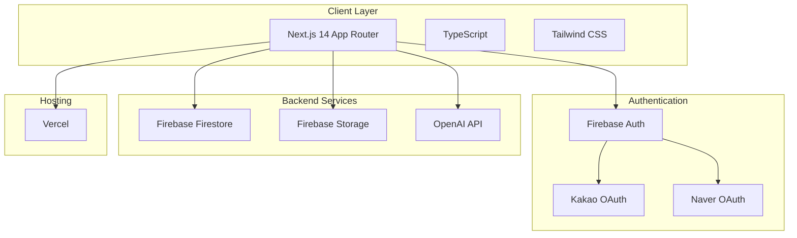
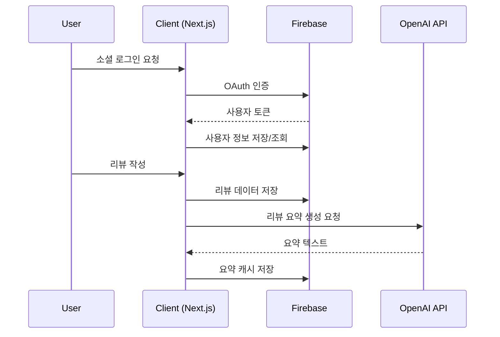

# Design Document

## Overview

강의 후기 플랫폼은 Next.js 14 App Router를 기반으로 한 풀스택 웹 애플리케이션입니다. Firebase를 백엔드 서비스로 활용하여 인증, 데이터베이스, 스토리지를 처리하고, OpenAI API를 통한 AI 기반 리뷰 요약 기능을 제공합니다. 소셜 로그인, 권한 기반 콘텐츠 접근 제어, 리뷰 및 로드맵 관리, 관리자 기능을 포함한 종합적인 플랫폼입니다.

## Architecture

### System Architecture



### Data Flow Architecture



## Components and Interfaces

### Frontend Components Structure

```
src/
├── app/
│   ├── (auth)/
│   │   └── login/
│   ├── reviews/
│   │   ├── [id]/
│   │   └── page.tsx
│   ├── roadmaps/
│   │   ├── [id]/
│   │   └── page.tsx
│   ├── write/
│   │   ├── review/
│   │   └── roadmap/
│   ├── mypage/
│   ├── admin/
│   └── layout.tsx
├── components/
│   ├── ui/
│   ├── auth/
│   ├── review/
│   ├── roadmap/
│   └── admin/
├── lib/
│   ├── firebase/
│   ├── auth/
│   ├── openai/
│   └── utils/
└── types/
```

### Core Components

#### 1. Authentication Components
- `SocialLoginButton`: 카카오/네이버 로그인 버튼
- `AuthProvider`: 인증 상태 관리 컨텍스트
- `ProtectedRoute`: 권한 기반 라우트 보호

#### 2. Review Components
- `ReviewCard`: 리뷰 카드 컴포넌트
- `ReviewForm`: 리뷰 작성 폼
- `ReviewDetail`: 리뷰 상세 보기
- `ImageUpload`: 인증 이미지 업로드
- `CommentSection`: 댓글 섹션

#### 3. Roadmap Components
- `RoadmapCard`: 로드맵 카드
- `RoadmapForm`: 로드맵 작성 폼
- `RoadmapDetail`: 로드맵 상세 보기

#### 4. Admin Components
- `AdminDashboard`: 관리자 대시보드
- `ReviewModerationPanel`: 리뷰 검수 패널
- `UserManagementPanel`: 사용자 관리 패널

### API Routes Structure

```
src/app/api/
├── auth/
│   └── callback/
├── reviews/
│   ├── route.ts
│   └── [id]/
├── roadmaps/
│   ├── route.ts
│   └── [id]/
├── admin/
│   ├── reviews/
│   ├── roadmaps/
│   └── users/
├── upload/
└── summary/
```

## Data Models

### Firebase Firestore Collections

#### Users Collection
```typescript
interface User {
  id: string;
  socialProvider: 'kakao' | 'naver';
  socialId: string;
  nickname: string;
  role: 'NOT_ACCESS' | 'LOGIN_NOT_AUTH' | 'AUTH_LOGIN' | 'AUTH_PREMIUM' | 'BLOCKED_LOGIN' | 'ADMIN';
  createdAt: Timestamp;
  updatedAt: Timestamp;
}
```

#### Courses Collection
```typescript
interface Course {
  id: string;
  platform: string;
  title: string;
  instructor?: string;
  category?: string;
  viewCount: number;
  createdAt: Timestamp;
}
```

#### Reviews Collection
```typescript
interface Review {
  id: string;
  courseId: string;
  userId: string;
  content: string;
  rating: number;
  status: 'PENDING' | 'APPROVED' | 'REJECTED';
  studyPeriod?: Timestamp;
  positivePoints?: string;
  negativePoints?: string;
  changes?: string;
  recommendedFor?: string;
  createdAt: Timestamp;
  updatedAt: Timestamp;
}
```

#### ReviewImages Collection
```typescript
interface ReviewImage {
  id: string;
  reviewId: string;
  storageUrl: string;
  createdAt: Timestamp;
}
```

#### Comments Collection
```typescript
interface Comment {
  id: string;
  reviewId: string;
  userId: string;
  content: string;
  status: 'PENDING' | 'APPROVED' | 'REJECTED';
  createdAt: Timestamp;
}
```

#### Roadmaps Collection
```typescript
interface Roadmap {
  id: string;
  title: string;
  description: string;
  authorId: string;
  courseId: string;
  nextCourseId?: string;
  status: 'PENDING' | 'APPROVED' | 'REJECTED';
  createdAt: Timestamp;
}
```

#### ReviewSummaries Collection (Cache)
```typescript
interface ReviewSummary {
  id: string;
  summary: string;
  reviewIds: string[];
  createdAt: Timestamp;
  expiresAt: Timestamp;
}
```

### Firebase Security Rules

```javascript
rules_version = '2';
service cloud.firestore {
  match /databases/{database}/documents {
    // Users can read their own data
    match /users/{userId} {
      allow read, write: if request.auth != null && request.auth.uid == userId;
      allow read: if request.auth != null && get(/databases/$(database)/documents/users/$(request.auth.uid)).data.role == 'ADMIN';
    }
    
    // Reviews - public read with role-based filtering
    match /reviews/{reviewId} {
      allow read: if resource.data.status == 'APPROVED';
      allow create: if request.auth != null;
      allow update: if request.auth != null && 
        (request.auth.uid == resource.data.userId || 
         get(/databases/$(database)/documents/users/$(request.auth.uid)).data.role == 'ADMIN');
    }
    
    // Admin only access
    match /admin/{document=**} {
      allow read, write: if request.auth != null && 
        get(/databases/$(database)/documents/users/$(request.auth.uid)).data.role == 'ADMIN';
    }
  }
}
```

## Error Handling

### Error Types and Handling Strategy

#### 1. Authentication Errors
```typescript
class AuthError extends Error {
  constructor(message: string, public code: string) {
    super(message);
    this.name = 'AuthError';
  }
}

// Usage
try {
  await signInWithSocial(provider);
} catch (error) {
  if (error instanceof AuthError) {
    showToast('로그인에 실패했습니다. 다시 시도해주세요.');
  }
}
```

#### 2. API Errors
```typescript
interface APIError {
  code: string;
  message: string;
  details?: any;
}

// API Route Error Handler
export function handleAPIError(error: unknown): Response {
  if (error instanceof FirebaseError) {
    return NextResponse.json(
      { error: { code: error.code, message: error.message } },
      { status: 400 }
    );
  }
  
  return NextResponse.json(
    { error: { code: 'INTERNAL_ERROR', message: '서버 오류가 발생했습니다.' } },
    { status: 500 }
  );
}
```

#### 3. Client-Side Error Boundary
```typescript
'use client';

interface ErrorBoundaryState {
  hasError: boolean;
  error?: Error;
}

export class ErrorBoundary extends Component<PropsWithChildren, ErrorBoundaryState> {
  constructor(props: PropsWithChildren) {
    super(props);
    this.state = { hasError: false };
  }

  static getDerivedStateFromError(error: Error): ErrorBoundaryState {
    return { hasError: true, error };
  }

  render() {
    if (this.state.hasError) {
      return <ErrorFallback error={this.state.error} />;
    }

    return this.props.children;
  }
}
```

### Error Recovery Strategies

1. **Network Errors**: 자동 재시도 메커니즘 (exponential backoff)
2. **Authentication Errors**: 자동 로그아웃 및 재로그인 유도
3. **Validation Errors**: 사용자 친화적 메시지와 수정 가이드
4. **Server Errors**: 에러 로깅 및 대체 UI 제공

## Testing Strategy

### Testing Pyramid

#### 1. Unit Tests (Jest + Testing Library)
```typescript
// Example: Review validation test
describe('Review Validation', () => {
  test('should validate required fields', () => {
    const invalidReview = { content: '', rating: 0 };
    expect(validateReview(invalidReview)).toBe(false);
  });
  
  test('should accept valid review', () => {
    const validReview = { 
      content: '좋은 강의였습니다', 
      rating: 5,
      courseId: 'course-1',
      userId: 'user-1'
    };
    expect(validateReview(validReview)).toBe(true);
  });
});
```

#### 2. Integration Tests
```typescript
// Example: API route test
describe('/api/reviews', () => {
  test('POST should create review with authentication', async () => {
    const mockUser = { uid: 'test-user', role: 'AUTH_LOGIN' };
    const reviewData = { content: 'Test review', rating: 4 };
    
    const response = await POST(
      new Request('http://localhost:3000/api/reviews', {
        method: 'POST',
        body: JSON.stringify(reviewData),
        headers: { authorization: `Bearer ${mockToken}` }
      })
    );
    
    expect(response.status).toBe(201);
  });
});
```

#### 3. E2E Tests (Playwright)
```typescript
// Example: User flow test
test('user can create and view review', async ({ page }) => {
  // Login
  await page.goto('/login');
  await page.click('[data-testid="kakao-login"]');
  
  // Create review
  await page.goto('/write/review');
  await page.fill('[data-testid="course-title"]', 'Test Course');
  await page.fill('[data-testid="review-content"]', 'Great course!');
  await page.selectOption('[data-testid="rating"]', '5');
  await page.click('[data-testid="submit-review"]');
  
  // Verify review appears in list
  await page.goto('/reviews');
  await expect(page.locator('text=Test Course')).toBeVisible();
});
```

### Testing Configuration

#### Jest Configuration
```javascript
// jest.config.js
module.exports = {
  testEnvironment: 'jsdom',
  setupFilesAfterEnv: ['<rootDir>/jest.setup.js'],
  moduleNameMapping: {
    '^@/(.*)$': '<rootDir>/src/$1',
  },
  collectCoverageFrom: [
    'src/**/*.{ts,tsx}',
    '!src/**/*.d.ts',
    '!src/**/*.stories.{ts,tsx}',
  ],
  coverageThreshold: {
    global: {
      branches: 80,
      functions: 80,
      lines: 80,
      statements: 80,
    },
  },
};
```

#### Firebase Emulator for Testing
```json
{
  "emulators": {
    "auth": {
      "port": 9099
    },
    "firestore": {
      "port": 8080
    },
    "storage": {
      "port": 9199
    }
  }
}
```

### Performance Testing

#### 1. Core Web Vitals Monitoring
- LCP (Largest Contentful Paint) < 2.5s
- FID (First Input Delay) < 100ms
- CLS (Cumulative Layout Shift) < 0.1

#### 2. Load Testing
- 동시 사용자 1000명 기준 응답시간 < 3초
- 이미지 업로드 처리 성능 테스트
- OpenAI API 호출 성능 및 fallback 테스트

### Security Testing

#### 1. Authentication Testing
- 소셜 로그인 플로우 보안 검증
- JWT 토큰 만료 및 갱신 테스트
- 권한 기반 접근 제어 테스트

#### 2. Data Validation Testing
- XSS 공격 방어 테스트
- SQL Injection 방어 (Firestore 쿼리)
- 파일 업로드 보안 테스트

#### 3. Firebase Security Rules Testing
```javascript
// firestore.rules.test.js
import { assertFails, assertSucceeds } from '@firebase/rules-unit-testing';

test('users can only read their own data', async () => {
  const db = getFirestore(getTestApp({ uid: 'user1' }));
  
  await assertSucceeds(db.collection('users').doc('user1').get());
  await assertFails(db.collection('users').doc('user2').get());
});
```

이 설계 문서는 시스템의 전체적인 아키텍처, 컴포넌트 구조, 데이터 모델, 에러 처리, 그리고 포괄적인 테스트 전략을 포함합니다. Next.js 14의 최신 기능들을 활용하면서도 확장 가능하고 유지보수가 용이한 구조로 설계되었습니다.