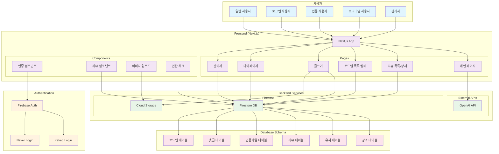
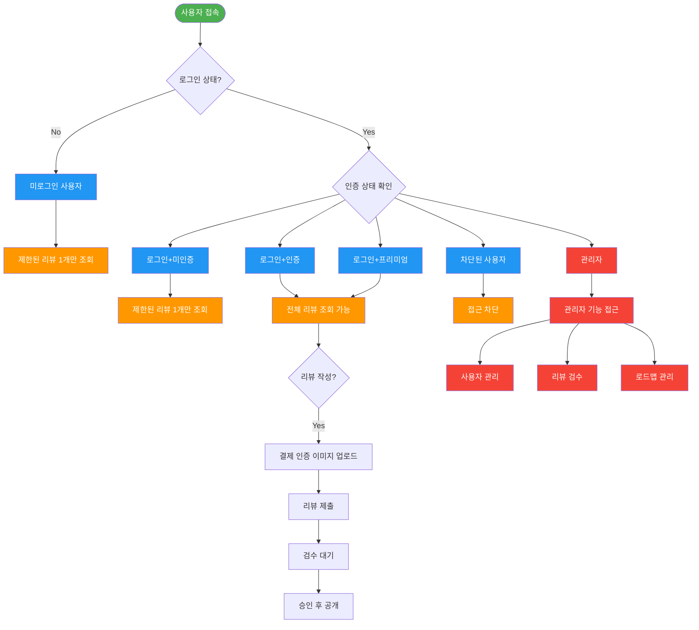

# review-filter FE (FrontEnd)
* 강의 후기를 모으는 플랫폼을 개발한다.
* 로그인 사용자에게는 특정 액션 후 리뷰를 다 볼수 있는 혜택을 제공한다. 
* 인증된 사용자에게는 리뷰, 광고없는 모드를 제공한다.


## 기능
* 회원가입
    * 소셜 로그인(카카오/네이버)
    * 랜덤 닉네임 자동 생성 (형용사+명사)
    * 약관 : 최소 개인정보만 수집
* 리뷰 공개 정책:
    * 일반가입 
        - 승인전 : 검수대기
        - 승인후 : 공개 (비회원은 요약만, 회원/작성자는 전체 열람 가능)
* 열람 제한 등급 관리
    * 기본
        - 일부 무료 미리보기 제공 (최초 1개만)
    * 전체 열람: 
        - 본인 리뷰 1개 이상 등록 
        - 프리미엄 결제
* 검수 기준: → 블라인드 처리
    * 욕설/비방
    * 광고성
    * 허위 결제 인증 

## 데이터 구조
* 강의테이블

|id|강의플랫폼|강의명|강사|카테고리|조회수|
|---|---|---|---|---|---|
|number|text|text|text|text|number|

* 유저테이블

|id|social|uuid|닉네임|권한|
|---|---|---|---|---|
|number|text|text|text|text|

* 유저강의리뷰테이블

|id|리뷰id|유저id|리뷰내용|점수|공개상태|작성일시|수강시기|좋았던점|아쉬웠던점|수강후 변화,적용사례|추천대상|
|---|---|---|---|---|---|---|---|---|---|---|---|
|number|number|number|text|double|text|datetime|datetime|text|text|text|text|


* 유저강의리뷰인증파일테이블

|id|유저강의리뷰id|저장소url|
|---|---|---|
|number|number|text|

* 댓글테이블

|id|리뷰id|내용|공개상태|
|---|---|---|---|
|number|number|text|text|

* 로드맵테이블

|id|로드맵소개|작성자id|강의id|next강의id|공개상태|로드맵소개|
|---|---|---|---|---|---|---|
|number|text|number|number|number|text|text|


* 공개상태

|공개상태|
|---|
|검수대기|
|공개|
|비공개|


* 권한타입

|권한명|코드|설명|분류|
|---|---|---|---|
|관리자|ADMIN|관리자|
|미로그인|NOT_ACCESS|로그인하지 않은 사용자|
|로그인+미인증|LOGIN_NOT_AUTH|로그인은 했지만 특별한액션없음|
|로그인+인증|AUTH_LOGIN|필수 액션을 한 상태 (1개이상 리뷰작성)|
|로그인+프리미엄|AUTH_PREMIUM|과금을 한 사용자|
|로그인+블록됨|BLOCKED_LOGIN|로그인, 블락됨-운영자에게 블락됨|


## 페이지 구성

|페이지|URL|기능|비고|
|---|---|---|---|
|메인|/|메인페이지||
|강의리뷰|/reviews|리뷰 목록 페이지를 제공한다.||
|학습 로드맵|/roadmaps|로드맵 목록 페이지 (MVP에서는 리뷰와 동일한 열람 정책 적용)||
|글쓰기|/write/review|리뷰 작성||
|로드맵작성|/write/roadmap|/로드맵 작성 페이지 (핵심 CTA)||
|마이페이지|/mypage|내 활동 관리||

### 페이지별 상세 기능
* 메인 화면구성
    - 메인노출 
        * 인기 카테고리 - 최근 100개 이내 작성된 리뷰의 카테고리를 count 하여 인기카테고리를 판별한다.
        * 최근 리뷰 요약 - 최근 작성된 리뷰를 요약하여 보여준다. LLM API 를 호출하여 캐시된 요약을 조회한다.
    - 상단 : 메뉴 네비게이션 
    - 푸터 : 회사소개 / 약관 / 개인정보처리방침 등 
* 로그인
    - social 인증 로그인 활용
    - 최소한의 정보를 저장 (platform / uuid / nickname)
* 강의리뷰
    - 권한별로 차등 노출함
    * NOT_ACCESS | LOGIN_NOT_AUTH
        - 최상위 한개만 노출 
    * AUTH_LOGIN | AUTH_PREMIUM
        - 리뷰 전체 노출
    * BLOCKED_LOGIN
        - 아무것도 보이지 않음
    
    * 리뷰 작성
        * 강의 플랫폼 에서 수강 완료를 인증한 강의를 리뷰함
            1. 강의 정보 입력
            2. 리뷰 내용 작성
            3. 결제 인증 이미지 업로드 필수 
                - 저장소 - 로컬스토리지 활용. 검수가 끝나면 삭제
                - 확장자는 - 이미지 - JPEG ,JPG , PNG, GIF, HEIC
                - 크기는 5메가. 업로드 되면 압축하여 이미지 분석한다.
    * 리뷰 상세 조회
        - 리뷰 상세 조회
        * 댓글 달기

* 학습 로드맵
    * 조회
        - 유저/관리자가 작성한 학습 로드맵
    * 로드맵 작성
        * 강의 하나를 들으면 다음 어떤걸 들으면 좋을지 로드맵을 작성
            1. 강의 정보 입력 , 다음 강의 정보를 입력

* 마이페이지
    * 내가 작성한 리뷰 갯수
        - 선택 시 리뷰 목록
            * 리뷰 검수 상태 표시
    * 내가 작성한 로드맵 갯수
        - 선택 시 로드맵 목록
    * 프로필 영역:
        * 내 닉네임
        * 현재 등급

* 어드민 관리
    * 유저 블락 관리하기
    * 리뷰글 블락 관리하기
    * 로드맵 블락 관리하기


### API 설계
> 기본 구조는 json 메시지 포맷의  API 통신으로 이루어진다.

* 메인
    * GET /
    * response (미로그인)
        * 가려진 강의 목록
        * 인기카테고리
        * 최근 리뷰요약
    * response (로그인)
        * 전체 강의 목록
        * 인기카테고리
        * 최근 리뷰요약

* 로그인
    * POST /login

* 강의리뷰
    * GET /reviews
        * 리뷰 목록
    * GET /reviews/{review-id}
        * 리뷰 상세
    * POST /reviews
        * 리뷰 작성

* 학습 로드맵
    * GET /roadmaps
        * 로드맵 목록
    * GET /roadmaps/{roadmap-id}
        * 로드맵 상세 조회
    * POST /roadmaps
        * 로드맵 작성
* 관리자모드
    * GET /admin/reviews
        * 리뷰 목록 조회
    * POST /admin/reviews/{review-id}
        * 리뷰 관리
    * GET /admin/roadmaps
        * 로드맵 목록 조회
    * POST /admin/roadmaps/{roadmap-id}
        * 로드맵 관리
    * GET /admin/users
        * 유저 목록 조회
    * POST /admin/users/{user-id}
        * 유저 관리

## 외부 서비스 연동
* Firebase: 인증, 데이터베이스, 스토리지
* Kakao Developers: 소셜 로그인
* Naver Developers: 소셜 로그인
* OpenAI: 리뷰 요약 생성

## 빌드
```sh
# 의존성 설치
npm install
# 개발 서버 실행
npm run dev
# 빌드
npm run build
# 프로덕션 실행
npm start
```

## 아키텍쳐
### 기술 스택
* **Frontend**: TypeScript, Next.js 14 (App Router)
* **Database**: Firebase Firestore
* **Storage**: Cloud Storage for Firebase
* **Authentication**: 소셜 로그인 (Kakao/Naver)
* **AI/ML**: OpenAI API (리뷰 요약)
* **Hosting**: Vercel (또는 Firebase Hosting)


### 시스템 아키텍처 다이어그램


### 사용자 플로우 다이어그램
