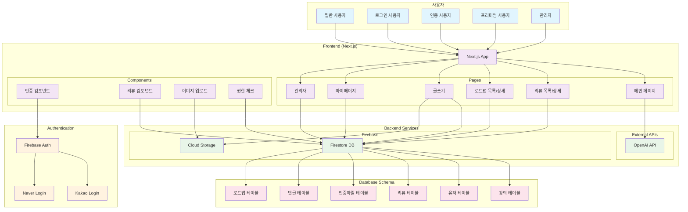

```mermaid
graph TB
    %% 사용자 레이어
    subgraph "사용자"
        U1[일반 사용자]
        U2[로그인 사용자]
        U3[인증 사용자]
        U4[프리미엄 사용자]
        U5[관리자]
    end

    %% 프론트엔드 레이어
    subgraph "Frontend (Next.js)"
        FE[Next.js App]
        subgraph "Pages"
            P1[메인 페이지]
            P2[리뷰 목록/상세]
            P3[로드맵 목록/상세]
            P4[글쓰기]
            P5[마이페이지]
            P6[관리자]
        end
        
        subgraph "Components"
            C1[인증 컴포넌트]
            C2[리뷰 컴포넌트]
            C3[이미지 업로드]
            C4[권한 체크]
        end
    end

    %% 인증 서비스
    subgraph "Authentication"
        AUTH[Firebase Auth]
        KAKAO[Kakao Login]
        NAVER[Naver Login]
    end

    %% 백엔드 서비스
    subgraph "Backend Services"
        subgraph "Firebase"
            FS[Firestore DB]
            STORAGE[Cloud Storage]
        end
        
        subgraph "External APIs"
            OPENAI[OpenAI API]
        end
    end

    %% 데이터 플로우
    U1 --> FE
    U2 --> FE
    U3 --> FE
    U4 --> FE
    U5 --> FE

    FE --> P1
    FE --> P2
    FE --> P3
    FE --> P4
    FE --> P5
    FE --> P6

    C1 --> AUTH
    AUTH --> KAKAO
    AUTH --> NAVER

    C2 --> FS
    C3 --> STORAGE
    C4 --> FS

    P1 --> OPENAI
    P2 --> FS
    P3 --> FS
    P4 --> FS
    P4 --> STORAGE
    P5 --> FS
    P6 --> FS

    %% 데이터베이스 구조
    subgraph "Database Schema"
        T1[강의 테이블]
        T2[유저 테이블]
        T3[리뷰 테이블]
        T4[인증파일 테이블]
        T5[댓글 테이블]
        T6[로드맵 테이블]
    end

    FS --> T1
    FS --> T2
    FS --> T3
    FS --> T4
    FS --> T5
    FS --> T6

    %% 스타일링
    classDef userClass fill:#e1f5fe
    classDef frontendClass fill:#f3e5f5
    classDef authClass fill:#fff3e0
    classDef backendClass fill:#e8f5e8
    classDef dbClass fill:#fce4ec

    class U1,U2,U3,U4,U5 userClass
    class FE,P1,P2,P3,P4,P5,P6,C1,C2,C3,C4 frontendClass
    class AUTH,KAKAO,NAVER authClass
    class FS,STORAGE,OPENAI backendClass
    class T1,T2,T3,T4,T5,T6 dbClass

```