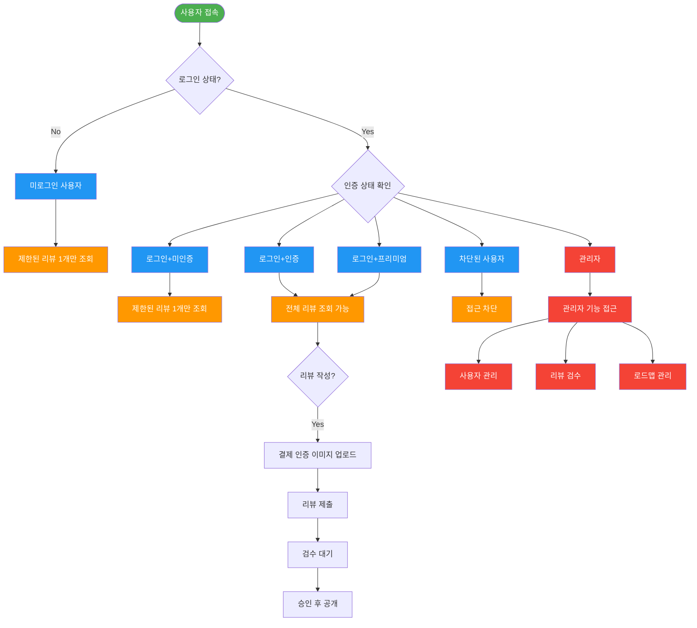

```mermaid
flowchart TD
    START([사용자 접속]) --> LOGIN{로그인 상태?}
    
    LOGIN -->|No| GUEST[미로그인 사용자]
    LOGIN -->|Yes| CHECK_AUTH{인증 상태 확인}
    
    GUEST --> GUEST_ACCESS[제한된 리뷰 1개만 조회]
    
    CHECK_AUTH --> NOT_AUTH[로그인+미인증]
    CHECK_AUTH --> AUTH[로그인+인증]
    CHECK_AUTH --> PREMIUM[로그인+프리미엄]
    CHECK_AUTH --> BLOCKED[차단된 사용자]
    CHECK_AUTH --> ADMIN[관리자]
    
    NOT_AUTH --> LIMITED[제한된 리뷰 1개만 조회]
    AUTH --> FULL_ACCESS[전체 리뷰 조회 가능]
    PREMIUM --> FULL_ACCESS
    BLOCKED --> NO_ACCESS[접근 차단]
    ADMIN --> ADMIN_ACCESS[관리자 기능 접근]
    
    FULL_ACCESS --> WRITE_REVIEW{리뷰 작성?}
    WRITE_REVIEW -->|Yes| UPLOAD_CERT[결제 인증 이미지 업로드]
    UPLOAD_CERT --> REVIEW_SUBMIT[리뷰 제출]
    REVIEW_SUBMIT --> MODERATION[검수 대기]
    MODERATION --> APPROVED[승인 후 공개]
    
    ADMIN_ACCESS --> MANAGE_USERS[사용자 관리]
    ADMIN_ACCESS --> MANAGE_REVIEWS[리뷰 검수]
    ADMIN_ACCESS --> MANAGE_ROADMAPS[로드맵 관리]

    %% 스타일링
    classDef startClass fill:#4caf50,color:#fff
    classDef userClass fill:#2196f3,color:#fff
    classDef actionClass fill:#ff9800,color:#fff
    classDef adminClass fill:#f44336,color:#fff
    
    class START startClass
    class GUEST,NOT_AUTH,AUTH,PREMIUM,BLOCKED userClass
    class GUEST_ACCESS,LIMITED,FULL_ACCESS,NO_ACCESS actionClass
    class ADMIN,ADMIN_ACCESS,MANAGE_USERS,MANAGE_REVIEWS,MANAGE_ROADMAPS adminClass
```